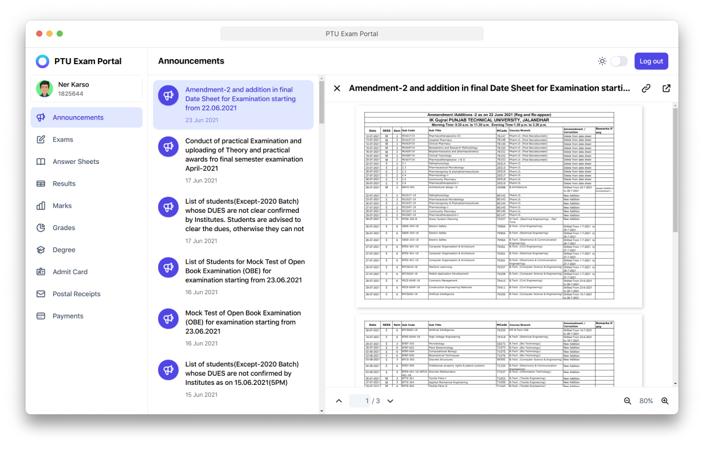

<p align="center">
  
</p>

<h1 align="center">PTU Exam Portal</h1>

<p align="center">The fastest and easiest way to access the IKGPTU exam portal.</p>

<p align="center">
  
</p>

> NOTE: This project is not affiliated with [I.K. Gujral Punjab Technical University](https://www.ptu.ac.in) nor do we host or serve any sensitive data (student records) on (or from) our server.

## Getting started

First, run the development server:

```sh
yarn dev
```

Open [http://localhost:3000](http://localhost:3000) with your browser to see the result.

## License

[MIT License](LICENSE)
